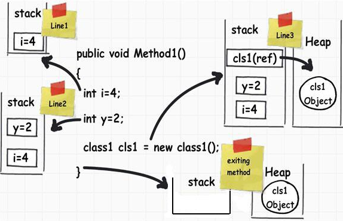

# Stack
In the stack, objects allocated within functions scope like local variables, arguments, code area addresses being executed prior to other function calls and function returns are stored.

The memory allocation happens in a sequencial way and, since the objects positions are known during compilation, we can assign names to these objects and directly access them. When a stack allocated object leaves it's scope, such object is automatically deleted (beware of languages without garbage collectors like C/C++). So there's no need to worry about memory allocation and deallocation when it comes to objects in the stack, but don't forget to mind the stack size. 

# Heap
Heap is the memory location where bigger objects are allocated, since this section is way larger than the stack, having it's size limited only by the available virtual memory. The objects in heap are those allocated with the keywords malloc (C) and new (C++). Since the position of these objects are unknown during compilation time, the only way to access it is by using pointers. Finally, it's important to deallocate these objects from memory with the use of free (C) and delete (C++).

  