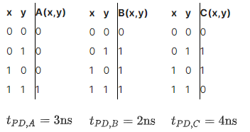

# 2.2.1 - A combinational system
Let's roll up our sleeves and try to build the functional and timing specifications for a system of combinational devices using the specifications of the component devices. We'll use the system diagram from the previous video:

  
And here are the specifications for the A, B, and C components:  

  

We'll start by determining the functional specification for the system, expressing the result as a truth table which shows the value of the output S for the eight possible combinations of values for the P, Q, and R inputs. Given a particular set of input values, you can use the truth tables for the A, B, and C components to work your way through the circuit, from inputs to outputs. Please fill in the truth table below with the correct values for the S output:  

|P|Q|R|  S  |
|-|-|-|----:|
|0|0|0|**0**|
|0|0|1|**1**|
|0|1|0|**0**|
|0|1|1|**1**|
|1|0|0|**0**|
|1|0|1|**1**|
|1|1|0|**0**|
|1|1|1|**0**|