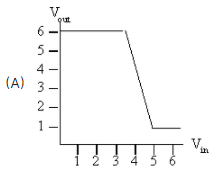

# LE2.4.1: Inverter madness

As VP of Engineering at Inverters-R-Us, you've received the following four voltage transfer characteristics from your integrated circuit development lab. The goal is to decide which of the devices could be used as a combinational inverter with positive noise margins. In other words, the device obeys the static discipline and there are choices for V_OL, V_IL, VI_IH and V_OH for which V_IL-V_OL > 0 and V_OH-V_IH > 0.
For each device, indicate whether it can be used as combinational inverter.  
  
  
**slope must be greater than |1|**  
slope = rise/run  
slope = 5/-1.5 = -3.33  

Calculando ângulo:  
tg x = -3.3  
portanto: x = -3.3/(1/tg) = -73.14  
tg -73.14 = -3.3  
Resposta: Yes, usable  
  
  
**slope must be greater than |1|**  
slope = rise/run  
slope = 3/-4 = -0.75  
x = -0.75/(1/tg) = -36.87  
tg -36.87 = -0.75  
Resposta: No, not usable  

  
**slope must be greater than |1|**  
slope = rise/run  
slope = 5/-7 = -0.71  
x = -0.71/(1/tg) = -35,53  
tg -35,53 = -0.71  
Resposta: No, not usable  

  
**slope must be greater than |1|**  
Uma vez que em pelo menos um ponto da curva a inclinação deve ser maior que 1:  
Resposta: Yes, usable  