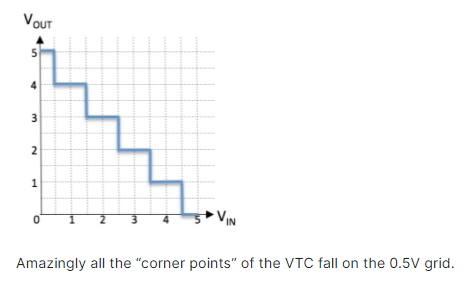
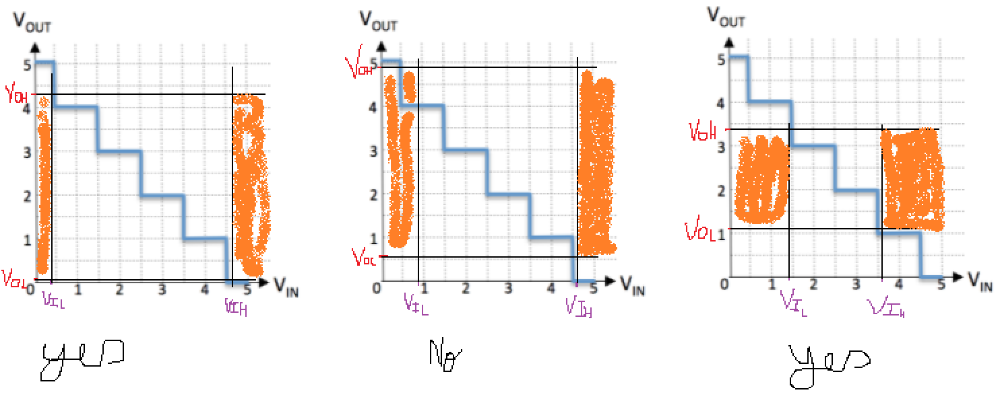

# The Static Discipline
Ivan Idea, a resident of Chelyabinsk who’s been watching the 6.004 videos on YouTube, was inspired to attach electrodes to opposite ends of a meteor fragment that came through his roof and produce a voltage transfer curve (VTC) of the resulting device, which is shown below.

  

Ivan is hoping he can sell his device as the world’s only extraterrestrial combinational inverter and has provided the table below suggesting possible voltage thresholds to achieve 0.3V noise margins. He’s happy to report that for any input voltage, the output voltage becomes stable within 1ns of the application of a new, stable input voltage. For each proposed specification please select “YES” if the device obeys the static discipline and “NO” if it does not.  

  