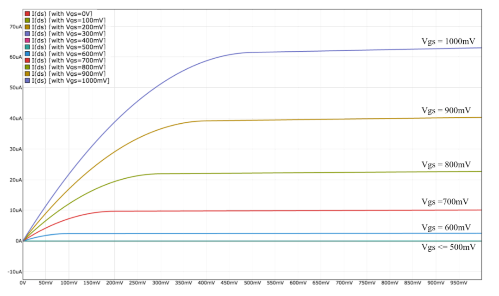
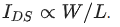

# LE3.1.1: MOSFET Measurements

Here's the figure from the last video showing I_DS as a function of V_GS. The threshold voltage, V_TH, of the MOSFET is 0.5V. The measurements were taken using an n-channel MOSFET with a width of 4 and a length of 1, expressed as multiples of the minimum feature size for a particular manufacturing process.  

In the graph below, the vertical axis is I_DS and the horizontal axis is V_DS.
  
  

Please use the plots to answer the following questions:  

(A) If V_S = .1V, V_D = 0.5V and V_G = 0.8V , how much current will flow through the MOSFET switch, i.e., what is I_DS? Note that the units are in micro Ampère(uA).  
V_GS = V_G - V_S = 0.8 - 0.1 = 0.7V  
V_DS = V_D - V_S = 0.5 - 0.1 = 0.4V  
So, finding in the graph:
I_DS = 10uA  
**I_DS (in uA, +=10%):  10**  
  
(B) Using the topmost curve in the figure, we see that when V_GS = 1V and
 V_DS = .15V, I_DS = 30uA. Please compute the effective resistance Reff using Ohm's Law, which tells us V_DS = I_DS * Reff.  
Reff = V_DS/I_DS = 0.15/(30x10^-6) = 5000  
 **Reff (in Ohms, +-10%): 5000 ohms**  
   
(C) If we changed the width of the MOSFET from 4 to 6 and remeasured I_DS when V_GS = .15V and V_DS = .15V, give an approximate value for the new I_DS measurement. Hint:   
When width = 4, I_DS = 30uA, so for width = 6:  
4 - 30  
6 - x  
x = (6*30)/4 = 45  
**I_DS (inuA, +-10%): 45**  