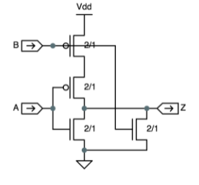

# LE3.3.1: CMOS Truth Table
Here's another simple CMOS circuit with series PFETs for the pullup circuit and parallel NFETs for the pulldown circuit.  
  
Please fill in the truth table below, giving the value of the output Z for the four possible combinations of the inputs values A and B.  
  
|A|B|  Z  |
|-|-|----:|
|0|0|**1**|
|0|1|**0**|
|1|0|**0**|
|1|1|**0**|  
  
**Explicação**: Quando A ou B tem nível lógico 1, o PFET estará desligado (OFF) e o NFET estará ligado (ON). Ou seja, se ao menos uma das entradas for 1, os PFETs (pullup) em série não conduzem, mas ao menos um dos NFETs (pulldown) conduz. Portanto, se ao menos uma das entradas for 1, a saída será 0. Já quando A=0 e B=0, ambos NFETs estarão desligados (OFF) e os PFETs estarão ligados (ON), portanto a saída Z será igual a 1.
Esta porta pode ser chamada de NOR.