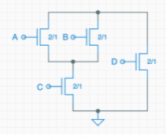
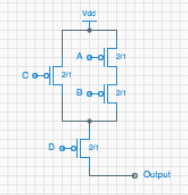

# LE3.4.1: Complementary circuits
The following diagram shows a schematic for the pulldown circuitry for a particular CMOS logic gate.  
  
Which of the following would be the most likely schematic for the pullup circuitry?  
  

  
**Explicação**: Os circuitos pullup são complementares do pulldown, portanto as ligações em série viram ligações em paralelo e as em paralelo viram em série. Adicionalmente, todos os NFETS são substituidos por PFET.