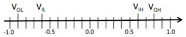

# Noise Margins

A new family of logic devices uses signaling voltages in the range −1V to +1V. 
One proposed assignment of our voltage specification is shown below. Observe:  
V_OL = -0.9v, V_IL = -0.6v, V_IH = 0.6, V_OH = 0.8.  
  
  
The noise immunity of a signaling specification is the smaller of the two noise margins. What is the noise immunity for the signaling scheme proposed above? Please give a numeric answer to the nearest .1 volt. If it is impossible to tell what the noise immunity is, write "NONE".  
  
Noise immunity (V): **0.2**  
  
The output voltage of an inverter is measured to be 0.9V in the steady state. The inverter is a combinational device obeying the signaling specification shown above. What is the best characterization of the steady-state input voltage  of the inverter when the measurement was made? Please give a numeric answer to the nearest .1 volt. If it is impossible to characterize V_IN, write "NONE".  
  
V_IN(V) < **.6**